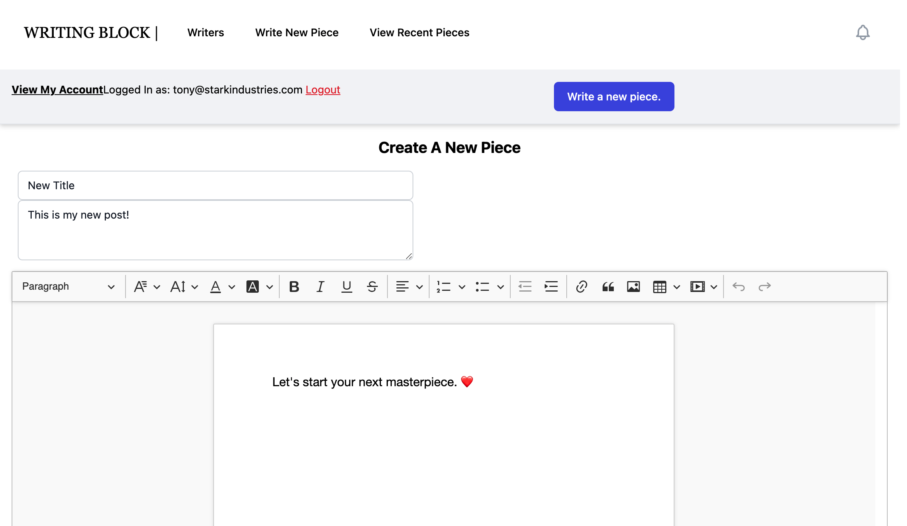

# Writing Block
## Final Report
## UPDATE: 05/13/2021

### Live Deployment https://writingblock.herokuapp.com/

Design Choices/Added Features (old, see video for updates):

1. We decided to switch from Vue.js to EJS because relearning how to implement functionality in Vue was too time consuming. We used Confetti Cuisine as a template and moved component by component. 
2. Updates on our User model to make it more robust, by adding security questions, address, etc. 
3. Added CRUD actions for users and restructured our web application to follow the structure discussed in week 10.
4. Added sessions and cookies to our web application
5. Used passport for handling user sign-up and sign-in
6. Used express validator to reimplement your validations and use sessions to show error messages to users - still need to add validation on every input. Planning to use this library to sanitize user generated html. https://www.npmjs.com/package/sanitize-html 
7. Extend views to show if user has logged in and also handle user logouts
8. Added proper error handling, usually?
9. Added post capability for users, where users are able to upload and post their writing to the website

# SUMMARY: 
See video

## Responsibility Distribution:
Both partners worked equally on front end and backend. We would frequently partner code via zoom. 

Future Plans:

See Video

# Instructions to Launch:
`npm install`
`node seed.js` // NOTE: The default is to our cloud Mongo instance. If you want to run mongo locally, please update the url in main.js and seed.js
`npm run dev`
